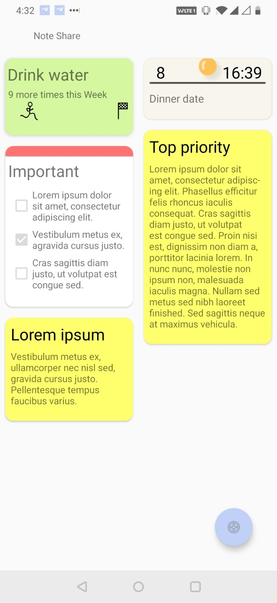

# Note-Share
ISE 2019 project- An Android note keeping app that uses NFC to increase sharability.

## What is Note Share?
Note Share is an Android note keeping app with a twist. Its all in the name: sharing. Note Share uses NFC (Near Field Communication) to allow the user to wri.....

## How to use Note Share?

## Update:
ISE 2019 2nd Place finisher.
